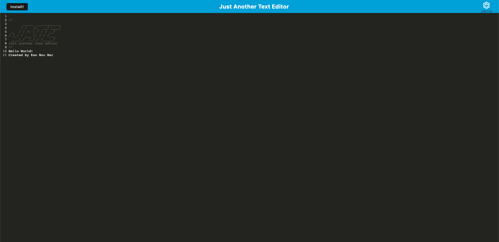

# (PWA): Another Text Editor

## Description

This text editor runs in the browser. The app is a single-page application that meets the PWA criteria. Additionally, it feature a number of data persistence techniques that serve as redundancy in case one of the options is not supported by the browser. The application will also function offline.

It uses a package called `idb`, which is a lightweight wrapper around the IndexedDB API. It features methods that are useful for storing and retrieving data, and is used by companies like Google and Mozilla.

## User Story

```
AS A developer
I WANT to create notes or code snippets with or without an internet connection
SO THAT I can reliably retrieve them for later use
```

## Screenshot

The following image is a screenshot of the deployed app. 



## Deployed Link

https://pwa-another-text-editor.herokuapp.com/
